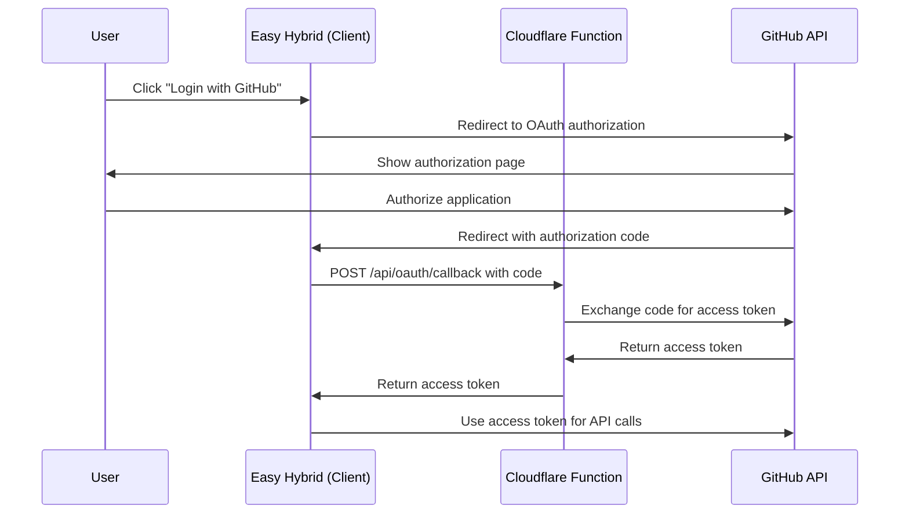

# Easy Hybrid - Deployment Guide

## Overview

Easy Hybrid is deployed on Cloudflare Pages with a serverless function for secure GitHub OAuth token exchange. This guide covers the deployment setup and configuration.

## Prerequisites

1. **GitHub OAuth App**: Create a GitHub OAuth App in your GitHub settings
2. **Cloudflare Account**: Access to Cloudflare Pages
3. **GitHub Repository**: Source code repository for automated deployments

## GitHub OAuth App Setup

1. Go to GitHub Settings → Developer settings → OAuth Apps
2. Click "New OAuth App"
3. Fill in the details:
   - **Application name**: Easy Hybrid
   - **Homepage URL**: `https://your-domain.pages.dev`
   - **Authorization callback URL**: `https://your-domain.pages.dev`
4. Note down the **Client ID** and **Client Secret**

## Cloudflare Pages Configuration

### Environment Variables

Set these environment variables in your Cloudflare Pages dashboard:

#### Production Environment
```bash
GITHUB_CLIENT_SECRET=your_github_client_secret_from_oauth_app
NODE_ENV=production
```

#### Preview Environment (optional)
```bash
GITHUB_CLIENT_SECRET=your_github_client_secret_from_oauth_app
NODE_ENV=preview
```

### Build Settings

- **Framework preset**: None (or Vite)
- **Build command**: `npm run build`
- **Build output directory**: `dist`
- **Root directory**: `/`

### Functions Configuration

The OAuth token exchange is handled by a Cloudflare Pages Function located at:
```
functions/api/oauth/callback.ts
```

This function:
- Handles CORS preflight requests
- Exchanges GitHub authorization codes for access tokens
- Securely stores the client secret server-side
- Returns access tokens to the client

## Deployment Process

### Automatic Deployment (Recommended)

1. Connect your GitHub repository to Cloudflare Pages
2. Set up the environment variables in the Cloudflare dashboard
3. Push changes to trigger automatic deployment

### Manual Deployment

1. Build the project locally:
   ```bash
   npm run build
   ```

2. Deploy using Wrangler CLI:
   ```bash
   npx wrangler pages deploy dist --project-name easy-hybrid
   ```

## Client-Side Configuration

The client-side OAuth configuration is in `src/services/githubOAuthService.ts`:

```typescript
private readonly CLIENT_ID = 'your_github_oauth_client_id';
private readonly REDIRECT_URI = window.location.origin;
```

Update the `CLIENT_ID` with your GitHub OAuth App's Client ID.

## OAuth Flow Architecture



## Security Considerations

1. **Client Secret**: Stored securely in Cloudflare environment variables
2. **CORS**: Function includes appropriate CORS headers
3. **State Parameter**: OAuth flow includes CSRF protection
4. **Token Storage**: Access tokens stored in localStorage (client-side only)
5. **HTTPS**: All communication over HTTPS in production

## Data Storage

- **Local Data**: Stored in browser localStorage
- **GitHub Gists**: User data synced to private GitHub gists
- **No Server Storage**: Zero data retention on servers

## Monitoring and Debugging

### Cloudflare Analytics
- Monitor function invocations and errors
- Check response times and success rates

### Browser DevTools
- Check localStorage for user data and tokens
- Monitor network requests for API calls
- Check console for error messages

### Common Issues

1. **OAuth Callback Fails**:
   - Verify CLIENT_ID matches GitHub OAuth App
   - Check redirect URI in GitHub OAuth App settings
   - Ensure GITHUB_CLIENT_SECRET is set correctly

2. **CORS Errors**:
   - Verify function includes CORS headers
   - Check if requests are going to correct endpoint

3. **Token Exchange Fails**:
   - Check GitHub OAuth App credentials
   - Verify client secret in environment variables
   - Check function logs in Cloudflare dashboard

## Environment-Specific Configuration

### Development
```bash
# .env.local (for local development)
VITE_GITHUB_CLIENT_ID=your_development_client_id
```

### Production
- Use Cloudflare Pages environment variables
- Ensure production GitHub OAuth App is configured
- Verify domain matches OAuth App settings

## Backup and Recovery

- User data is stored in GitHub gists
- No server-side data to backup
- Users can export/import data manually
- Data sync ensures consistency across devices

## Performance Optimization

1. **CDN**: Cloudflare's global CDN for fast loading
2. **Caching**: Static assets cached efficiently
3. **Functions**: Serverless functions for OAuth only
4. **Lazy Loading**: Components loaded as needed

## Support and Troubleshooting

For issues with the deployment:

1. Check Cloudflare Pages deployment logs
2. Verify environment variables are set correctly
3. Test OAuth flow in browser developer tools
4. Check GitHub OAuth App configuration

## Version Control

- Tag releases for production deployments
- Use preview deployments for testing
- Keep deployment configuration in version control